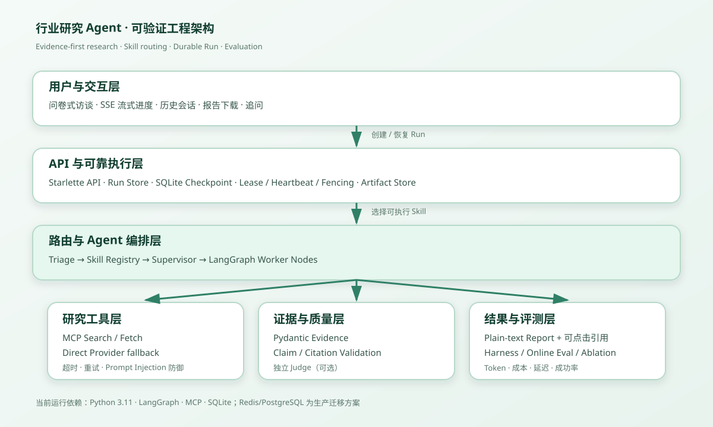

# Industry Research Agent

## 简历项目摘要（2026-07～2026-09）

**行业研究 Agent｜多智能体联网研究系统（导师合作项目）**

- **项目描述：** 面向创业构思、企业研究、经营诊断和工厂能力扩展，搭建“访谈澄清—联网检索—证据校验—决策报告”闭环，避免通用模板和无依据数字。
- **技术栈与后端：** Python、LangGraph、MCP、Tool Calling、Starlette/SSE、Pydantic、MySQL、Redis Streams、Docker；生产模式以 MySQL 作为任务状态主库、Redis Streams 作为队列与事件层，并由独立 Worker 执行 Agent；SQLite 仅用于 LangGraph Checkpoint 和本地开发模式。
- **工作流与路由：** 基于 LangGraph 实现 Planner（Supervisor）–Worker 与 Skill Router，按场景选择研究维度；支持动态访谈、追问承接、会话恢复，以及范围明确问题的直接回答。
- **证据链：** 通过 MCP/Direct Provider 搜索并读取网页，将 URL、摘录、年份、地区和可信度建模为 Evidence，校验 Claim 与引用绑定；未通过校验的结论降级为证据不足。
- **可靠执行：** 实现 MySQL Run Store、Redis Streams Consumer Group、超时/重试/取消、Lease/Fencing、幂等和并发隔离；SQLite Checkpoint 仅保存 Agent 会话状态，Evidence、报告和 Trace 由 Artifact Store 按 run 原子写入 JSON 文件；同时区分会话状态、任务生命周期与用户明确确认的长期记忆。
- **质量验证：** 71 个 Python 回归测试、38 个流程 Harness、18 个可靠性故障场景和 12 个 Skill Harness，覆盖重复提交、断线恢复、Worker 崩溃、过期写入和非法 Blueprint；另完成单 Agent / 多 Agent / Evidence 消融实验。
- **在线基线：** 10 个行业案例各运行 30 次，共完成 300 次 Direct Provider 联网评测；流程完成率 100%、URL 有效率 100%、工具成功率 95.9%、引用覆盖率 94.4%，平均耗时 28.7 秒、P95 35.8 秒；严格质量门槛通过率 71%。

> 项目重点不是增加 Agent 数量，而是验证：多智能体研究能否在质量、成本、延迟和可靠性之间取得可解释的平衡。

## 可验证结果

| 指标 | 当前基线 |
|---|---:|
| 真实在线任务完成率 | 100%（300/300） |
| 引用 URL 有效率 | 100% |
| 工具成功率 | 95.9% |
| Skill 初始路由准确率 | 100% |
| 平均总 Token | 14,638（输入 12,928 / 输出 1,710） |
| 引用覆盖率 | 94.4% |
| 平均在线任务耗时 | 28.7 秒 |
| P95 在线任务耗时 | 35.8 秒 |
| 严格质量门槛通过率 | 71%（213/300） |
| 真实联网并发 | 5/5 成功，P95 约 38.9 秒 |
| Python 回归测试 | 68/68 |
| 流程 / 可靠性 / Skill Harness | 38/38 · 18/18 · 12/12 |

评测日期：2026-09-07，Direct Provider，10 个案例 × 30 次。模型、网络和搜索结果会影响在线指标；“流程完成”表示任务成功结束，“严格质量门槛通过”还要求引用覆盖、URL、维度完成和时延同时达标。原始结果保存在 `industry_research_agent/eval/results/2026-09-07-summary.json`。

## 系统架构



核心链路：

```text
访谈澄清 → Skill Router → LangGraph Supervisor / Analysts
         → MCP Search + Fetch（Direct 降级）
         → Evidence → Claim/Citation 校验 → 报告与 Artifact
```

状态分工：生产模式下 MySQL `runs` 表保存 queued/running/retrying 等任务生命周期、幂等、取消、Lease 和 fencing token；Redis Streams 保存待执行任务和 `research:events:{run_id}` 事件流；SQLite Checkpoint 仅保存对话、访谈进度、Agent 状态和研究过程；Session Catalog 保存历史会话索引；User Memory 只保存用户明确确认的事实；Artifact Store 原子保存该次运行的报告、Evidence 和 Trace。页面关闭后任务可以继续，重新打开可恢复历史会话。本地模式可切换为 SQLite Run Store + 进程内执行。

## 快速启动

要求 Python 3.11+。

```powershell
cd industry_research_agent
python -m venv .venv
.\.venv\Scripts\python.exe -m pip install -r requirements.txt
Copy-Item .env.example .env
# 在 .env 中填写 LLM_API_KEY；建议配置 TAVILY_API_KEY
.\scripts\run_web.bat
```

打开 `http://127.0.0.1:8000`。

## 快速验证

```powershell
.\.venv\Scripts\python.exe -m scripts.preflight
.\.venv\Scripts\python.exe -m pytest -q
.\.venv\Scripts\python.exe -m eval.eval_harness
.\.venv\Scripts\python.exe -m eval.reliability_harness
.\.venv\Scripts\python.exe -m eval.skill_harness
```

完整演示步骤见 [Demo 手册](industry_research_agent/docs/DEMO_RUNBOOK.md)，技术细节见[项目完整 README](industry_research_agent/README.md)，可直接使用的项目经历见[简历描述](industry_research_agent/docs/RESUME_PROJECT.md)。

## 为什么不是普通聊天机器人

- 访谈：先收集会改变结论的用户条件，不直接套行业模板。
- 研究：真实搜索与网页读取，而不是依赖本地行业知识包。
- 证据：外部事实和数字必须绑定 Evidence；证据不足时降级而非编造。
- 可靠性：支持 Run 状态、取消、重试、超时、Lease、Fencing 和断点恢复。
- 评测：保留在线基线、消融实验和故障 Harness，不用主观 Demo 代替指标。

## 当前限制

- 本地模式使用 SQLite；生产 Compose 模式已支持 MySQL Run Store、Redis Streams 和独立 Worker，LangGraph Checkpoint 仍使用共享 SQLite 卷。
- 当前未实现企业认证、多租户权限和分布式任务队列。
- 独立 Claim Judge、模型成本需要按实际供应商配置，项目不会虚构结果。
- 公网 Demo 与 GitHub 仓库地址需在发布后补充；本仓库已提供发布材料和演示手册。
